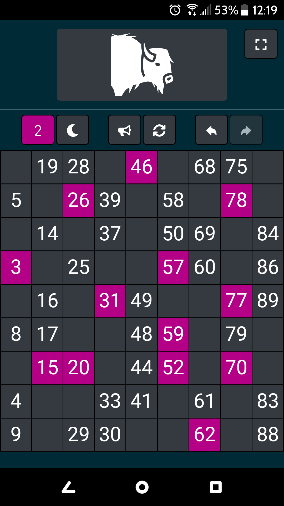
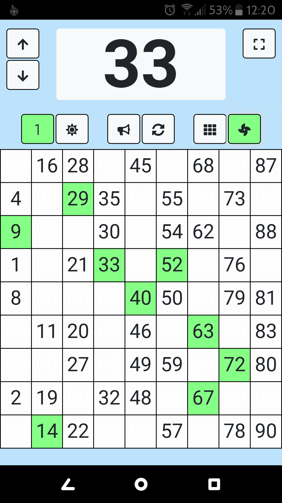
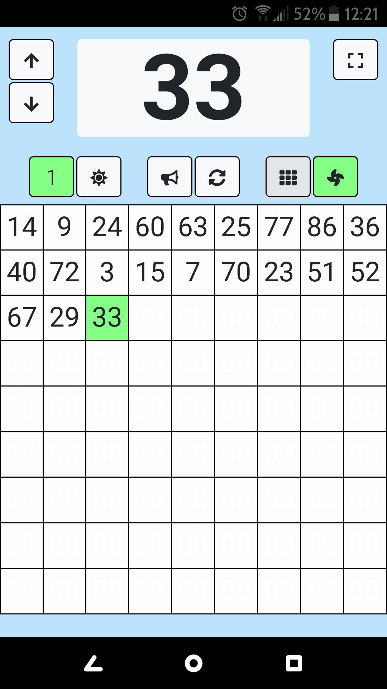
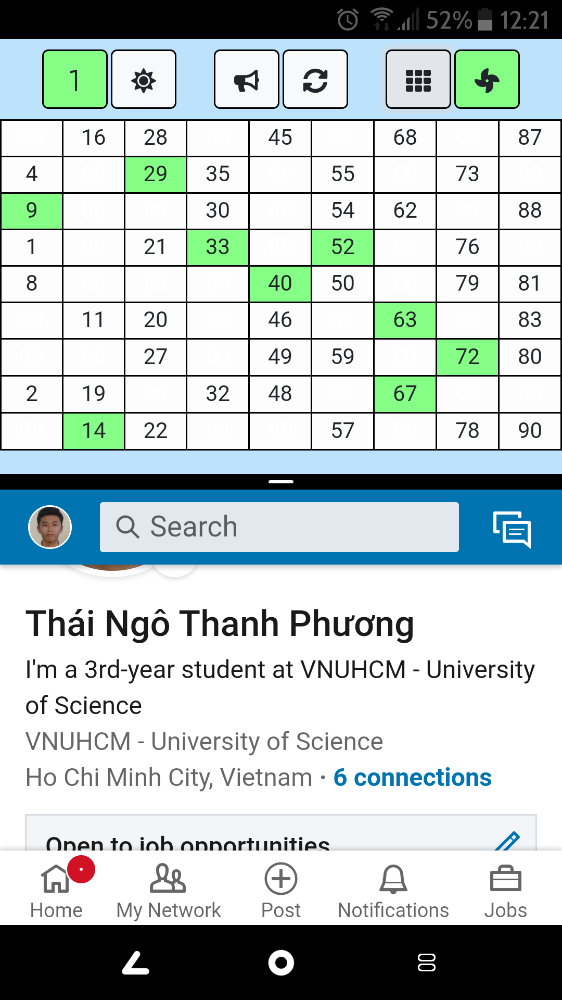

### Dò lô tô

- Trang web chơi lô tô tết trực tuyến làm bằng React
- Hỗ trợ 8 màu, 1 màu có 2 tờ => 16 người chơi cùng lúc
- Hỗ trợ chuyển đổi giao diện ngày và đêm
- Hỗ trợ Undo / Redo giúp khôi phục thao tác nhầm
- Hỗ trợ reset sau khi hoàn thành ván chơi
- Hỗ trợ âm thanh khi Đợi / Kinh
- Hỗ trợ tính năng kêu số (tự động kêu và dò khi nhấn) và xem các số đã kêu theo thứ tự
- Hỗ trợ responsive cho tất cả các màn hình điện thoại khác nhau, kể cả tách màn hình để có thể sử dụng 2 ứng dụng cùng lúc.
- Hỗ trợ lưu kết quả liên tục, nếu điện thoại crash hoặc lỡ refresh trang web, ván chơi và các tùy chỉnh sẽ không bị mất.

### Chụp màn hình (có thể xem ở folder screenshots)

